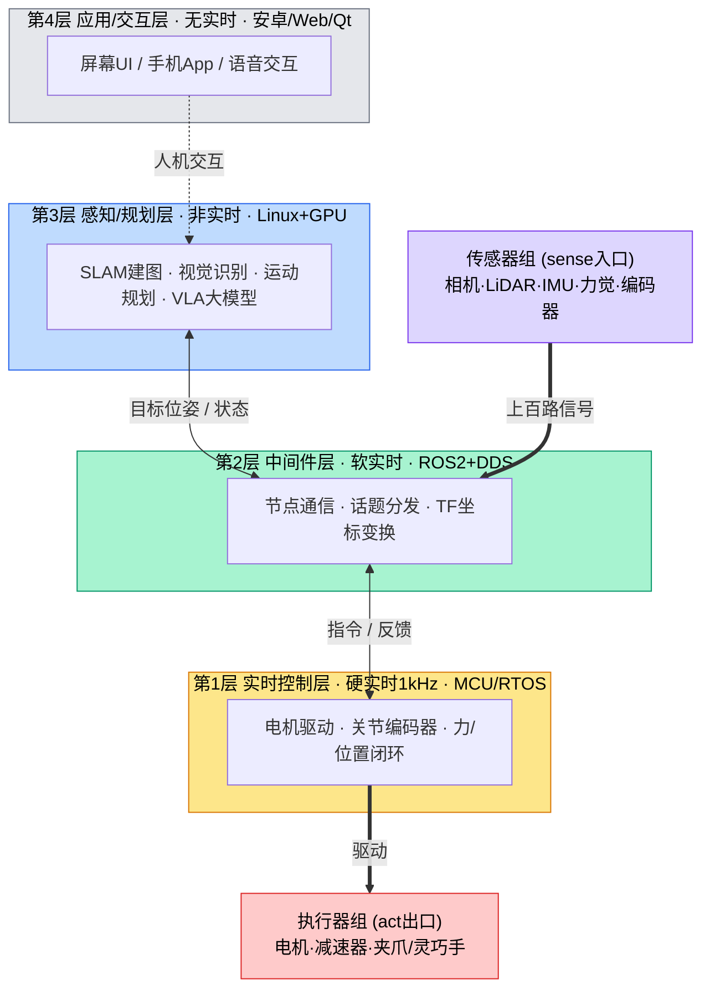
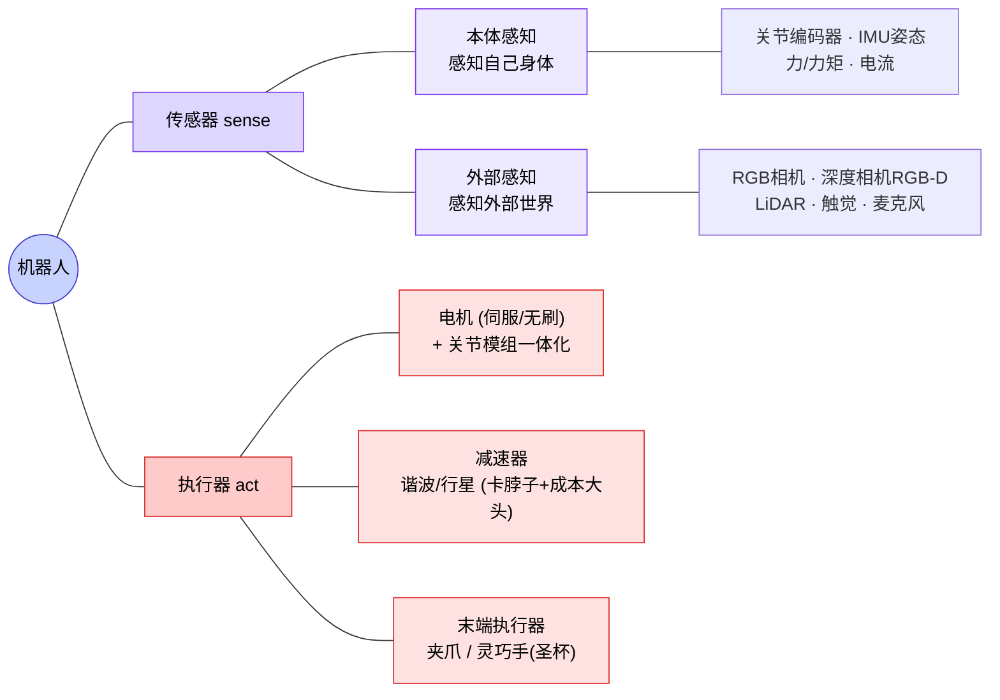
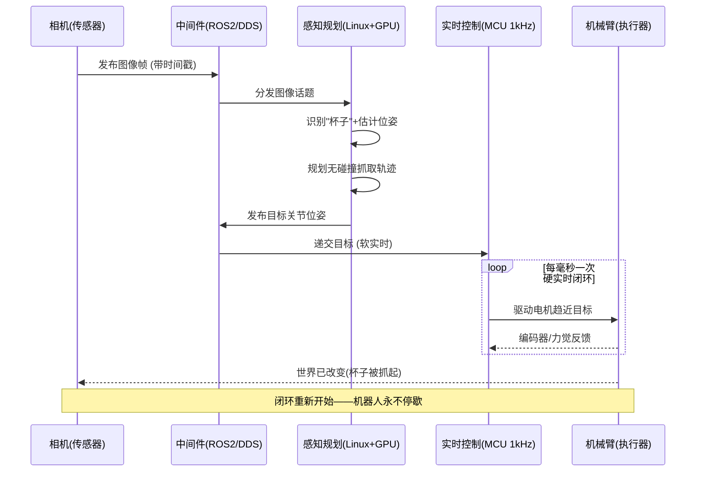

# 机器人系统构造 —— 从整体到细节

> 活文档。这份把 M0 世界观（sense→plan→act 闭环 + 分层异构）连同**硬件实体**和**演进方向**一起沉淀成完整的"系统构造"认知。
> 阅读顺序刻意自顶向下：先看全景，再拆传感器/计算/执行器，最后看数据怎么流、往哪演进。

---

## 一、一句话主干

> **机器人 = 一个永不停歇的 sense→plan→act 闭环；这个闭环被"实时性"逼成了分层异构的硬件系统。**

- **闭环**：它在干嘛——不停地 感知 → 规划 → 执行 → 再感知。
- **分层异构**：它怎么搭出来的——因为这三件事快慢差好几个数量级，一颗大脑同时干会互相拖死，只能拆到不同板子、不同系统上各转各的。

两者是一件事的两面。下面所有细节，都挂在这句主干上。

---

## 二、全景架构图（先看这张，把整体框住）

四层，实时性从下往上递减；每层都是**真实的硬件实体**，不是软件抽象。

**看图抓三点**：
1. 数据主干：`传感器 → 中间件 → 感知规划 → 中间件 → 控制 → 执行器`，跑一圈就是一次 sense→plan→act。
2. 颜色分层：黄=硬实时命根子、绿=中间件（我的甜区之一）、蓝=感知规划（VLA/数据入口）、灰=应用层（最可替代）、紫=输入、红=输出。
3. **应用层是虚线接入**——它不在实时数据主干上，这也直观说明了它为什么最可替代。

---

## 三、计算单元 —— "大脑的根本"，但它是集群不是一块板

关键认知：成熟机器人**没有"一块主板"，是一个计算集群**，恰好对应上面的分层。拿人的神经系统类比最贴切：

| 硬件 | 角色（人体类比） | 典型器件 | 对应层 |
|------|-----------------|---------|--------|
| **主计算单元** | 大脑皮层——想 | NVIDIA **Jetson Orin**（机器人界最主流边缘AI平台，ARM+GPU一体）/ x86工控机+独立RTX / 特斯拉自研芯片 | 第3层 感知规划 |
| **实时控制单元** | 脊髓反射——本能 | **MCU**（STM32类）/ DSP / 每个关节自带驱动板 | 第1层 实时控制 |
| **通信骨干** | 神经 | **EtherCAT**（工业实时以太网）/ CAN总线 / 以太网 | 第2层 中间件物理层 |

**为什么大脑和脊髓要分开？** 你踩到钉子是脊髓直接让你缩脚，不会等大脑想完。机器人一样：关节的 1kHz 实时控制交给 MCU 的"脊髓"，绝不劳 Jetson"大脑"——**因为不能让"思考（慢、算力大）"卡住"反射（必须雷打不动）"。分层不是抽象，物理上就是不同板子。**

---

## 四、传感器与执行器 —— 闭环的两极

先分清一个常被并列错的概念：

- **摄像头 = 传感器(sensor)** → **sense**（输入），感知世界
- **机械臂 = 执行器(actuator)** → **act**（输出），改变世界

**输入设备和输出设备是闭环的两极。** 下图把两极的家族一次理清：

**量级感**（人形为例，因型号而异、⚠️需核实具体数）：自由度 20~50 个 → 光关节编码器+电机就几十路，加 IMU、力觉、头部 2~4 相机、手部触觉…… **一台人形轻松上百路传感信号并发**。

→ 这就把"多路异构传感器"具象了：真有上百路、种类各异、频率各异、坐标系各异的信号同时涌入。**怎么对齐/融合/不丢不乱 = 中间件层 + 数据链路的活 = 我的甜区为什么值钱。**

**执行器补两个洞察**：
- **减速器**（谐波/行星）是精密关节关键 + 成本大头，谐波减速器长期被日本厂商近乎垄断，是人形**国产化降本的核心卡脖子点**——一堆国内公司在猛攻。
- **电动化是大趋势**：波士顿动力早期 Atlas 用液压，现在也转电动；为了安全和人共处，力控/柔顺（碰到人会让）成刚需。

---

## 五、"抓杯子"端到端时序图 —— 把闭环画活

一个具体动作在四层间跑一圈，就是一次完整的 sense→plan→act：

**看图抓两点**：
1. **循环框**画的就是第1层的 1kHz 硬实时闭环——大脑只下发一次"目标位姿"，趋近和顶住是脊髓在毫秒级反复干。
2. 最后一箭头回到相机：**act 改变了世界，sense 又能感知到新世界，闭环重启**。这就是"永不停歇"的字面意思。

---

## 六、未来演进方向（给洞察，不只罗列）

1. **计算：多板拼凑 → 中央域控制器**。现在传感器/关节各自带板、线束成坨；未来像**汽车EE架构**那样收敛成几个域控制器，甚至把 VLA 推理做进专用端侧AI芯片。
2. **传感器：触觉大爆发**。视觉已近饱和，"手感"是灵巧操作最大缺口——视觉-触觉一体传感器（GelSight类）是热点。**传感器越多，数据链路越复杂——对我是利好。**
3. **执行器：全面电动化 + 柔顺控制**。安全和人共处的刚需。
4. **架构：端到端可能"吃掉"中间的显式规划层**（VLA 感知直接出动作）。

**但两条底座吃不掉**（和整份认知的结论一致）：
- **第1层实时控制**——物理约束决定，永远需要。
- **数据入口（数据链路）**——模型再强也要喂数据，反而更重要。

→ **无论上层怎么被大模型重写，底层实时控制（物理决定）+ 数据链路（喂养决定）不会消失，反而加固。这就是我该站的地基位置。**

---

## 待核实 / 待补（TODO）

- [ ] ⚠️ 人形传感器/自由度的具体数字量级（能联网时核实典型型号如 Optimus/宇树 G1 的公开参数）
- [ ] Jetson Orin 具体型号与算力、EtherCAT vs CAN 的适用场景，用到时再深入
- [ ] 灵巧手/触觉传感器的代表方案（做到甜区触觉数据时再展开）
