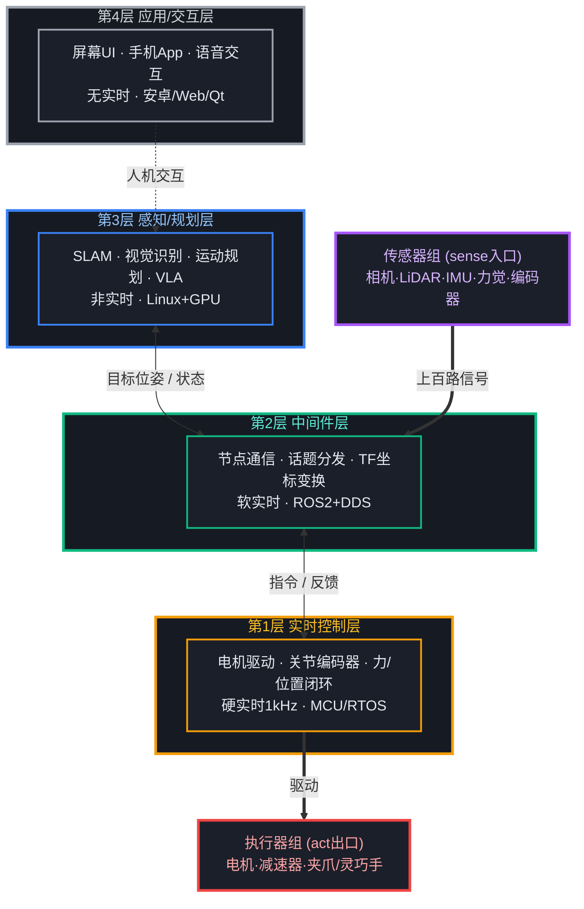
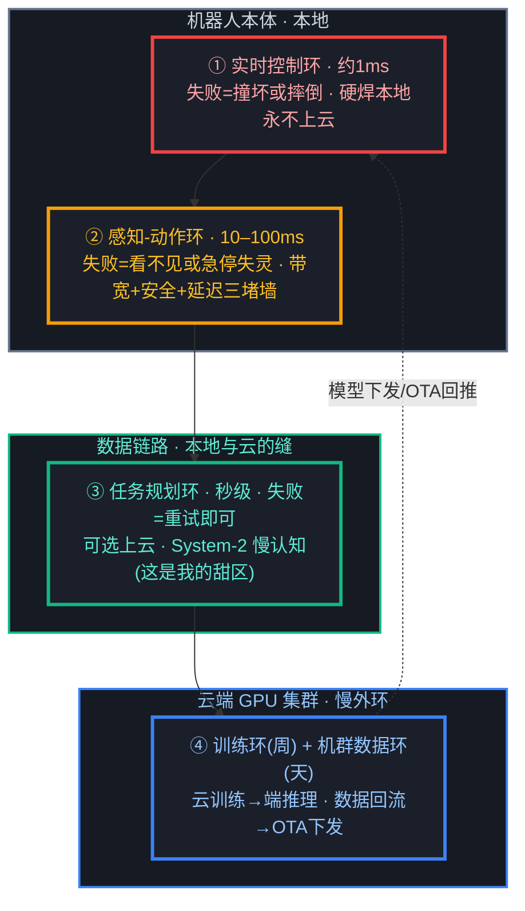
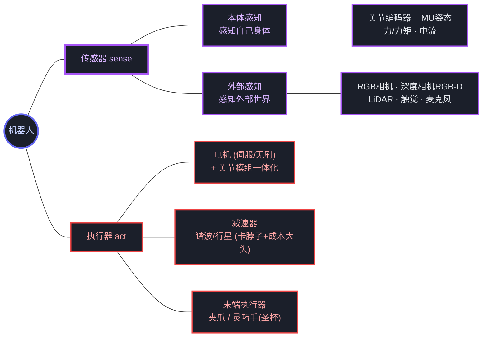
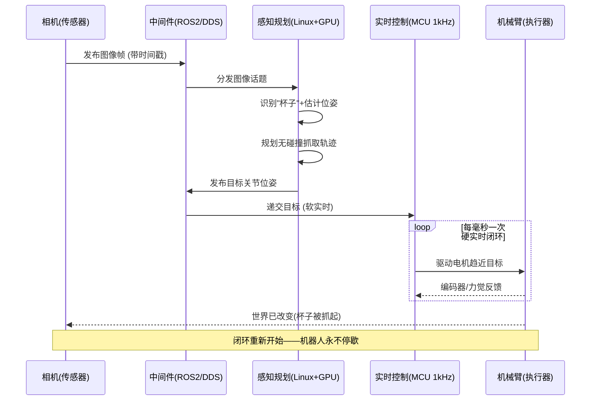

# 机器人系统构造 —— 从整体到细节

> 活文档。这份把 M0 世界观（sense→plan→act 闭环 + 分层异构）连同**硬件实体**和**演进方向**一起沉淀成完整的"系统构造"认知。
> 阅读顺序刻意自顶向下：先看全景，再拆传感器/计算/执行器，最后看数据怎么流、往哪演进。

---

## 一、一句话主干

> **机器人 = 一个永不停歇的 sense→plan→act 闭环；这个闭环被"实时性"逼成了分层异构的硬件系统。**

- **闭环**：它在干嘛——不停地 感知 → 规划 → 执行 → 再感知。
- **分层异构**：它怎么搭出来的——因为这三件事快慢差好几个数量级，一颗大脑同时干会互相拖死，只能拆到不同板子、不同系统上各转各的。

两者是一件事的两面。下面所有细节，都挂在这句主干上。

---

## 二、全景架构图（先看这张，把整体框住）

四层，实时性从下往上递减；每层都是**真实的硬件实体**，不是软件抽象。

**看图抓三点**：
1. 数据主干：`传感器 → 中间件 → 感知规划 → 中间件 → 控制 → 执行器`，跑一圈就是一次 sense→plan→act。
2. 颜色分层：黄=硬实时命根子、绿=中间件（我的甜区之一）、蓝=感知规划（VLA/数据入口）、灰=应用层（最可替代）、紫=输入、红=输出。
3. **应用层是虚线接入**——它不在实时数据主干上，这也直观说明了它为什么最可替代。

---

## 三、计算单元 —— "大脑的根本"，但它是集群不是一块板

关键认知：成熟机器人**没有"一块主板"，是一个计算集群**，恰好对应上面的分层。拿人的神经系统类比最贴切：

| 硬件 | 角色（人体类比） | 典型器件 | 对应层 |
|------|-----------------|---------|--------|
| **主计算单元** | 大脑皮层——想 | NVIDIA **Jetson Orin**（机器人界最主流边缘AI平台，ARM+GPU一体）/ x86工控机+独立RTX / 特斯拉自研芯片 | 第3层 感知规划 |
| **实时控制单元** | 脊髓反射——本能 | **MCU**（STM32类）/ DSP / 每个关节自带驱动板 | 第1层 实时控制 |
| **通信骨干** | 神经 | **EtherCAT**（工业实时以太网）/ CAN总线 / 以太网 | 第2层 中间件物理层 |

**为什么大脑和脊髓要分开？** 你踩到钉子是脊髓直接让你缩脚，不会等大脑想完。机器人一样：关节的 1kHz 实时控制交给 MCU 的"脊髓"，绝不劳 Jetson"大脑"——**因为不能让"思考（慢、算力大）"卡住"反射（必须雷打不动）"。分层不是抽象，物理上就是不同板子。**

---

## 四、计算放哪 —— 本地 vs 云,靠"环的松紧"分

上一节讲的分层(MCU/Jetson/EtherCAT)是**机器人身上的分**,被"实时性"逼出来,整套集群都在本体内。这一节是**另一根垂直的轴**:有没有算力跑到机器人**身体之外**的服务器/云上?两根轴别叠一起。

**决定放哪的那把尺子:延迟预算 × 失败代价。** 这和做语音全双工时天天权衡的东西一模一样:

| | 延迟能忍多久 | 失败代价 | 结论 |
|---|---|---|---|
| **语音全双工** ASR/LLM/TTS | 300ms 往返可接受 | 没听懂,再说一遍(便宜) | **几乎全推上云** |
| **机器人** 1kHz 控制 | 1ms,网络抖动就冲垮 | 撞坏东西 / 人形当场摔(要命) | **永久焊死本地** |

同一把尺子,语音世界量出来"上云",机器人的实时核心量出来"焊死本地"——**因为机器人失败会伤人。** 这就是"本地 vs 云"最反直觉、最该记住的点。

### 内环留本地,外环上云(核心心智模型)

> **环越紧越必须本地,环越慢越可以上云。** 闭环越紧,一点网络抖动就能把它冲垮,失败还越致命。

- **① 1kHz 控制环(毫秒)→ 硬本地**:物理约束,「三、计算单元」里"第1层永远需要"换到云这根轴上就是这句。
- **② 感知-动作环(百毫秒)→ 本地**:理论能 offload,但三堵墙挡着——**断网不能瞬间变瞎(安全)、多路相机+LiDAR原始流实时上云推不动(带宽)、往返叠进闭环会累积到失控(延迟)**。Jetson 就是干这层的。
- **③ 任务规划环(秒级)→ 可选上云**:这是**唯一**一处云推理正往运行时渗的地方。问云端大模型"怎么泡咖啡"要个高层计划,秒级延迟、失败重试即可。有人借 Kahneman 叫它 **System 2(慢/云)+ System 1(快/本地)**——云给菜谱,本地执行每一步,云永远不碰"驱动电机"那层。
- **④ 训练环(周)+ 机群数据环(天)→ 云**:云最大的角色不是推理,是**训练**。VLA/RL 在云端 GPU 集群离线训完,把模型**下发到本体跑**——主流范式一句话:**云训练,端推理**。每台机器人再把轨迹/失败案例传回云,聚合重训、OTA 推回,构成以天/周计的慢外环(特斯拉机群即此)。

### 断网了会怎样 —— 优雅降级,离线是基线不是异常

有个直觉陷阱要主动拆掉:**在云/App/语音世界,主导力是成本和轻量化,所以"能上云的尽量上云,端上留个壳,断网了再兜底"**。这个反射对那些行业是对的,但**搬到机器人上会把主次搞反**。机器人有一条更硬的约束压在成本之上:**闭环的实时性和安全**。内环上云省下的那点算力钱,换来的是"一次网络抖动就摔机/伤人"——这笔账永远算不平。

所以机器人的设计原则是**反过来的**:

| | 主导力 | 默认放哪 | 断网时 |
|---|---|---|---|
| **云/语音(旧世界)** | 成本、轻量化 | 尽量上云,端上留壳 | 功能大面积降级甚至不可用(能忍) |
| **机器人** | 实时性、安全 | **尽量本地**,云只做外环 | **核心运动能力毫发无损**(必须) |

业界把这条铁律叫 **优雅降级(graceful degradation)**:**本体必须能"离线自足"地完成安全职责;云在,能力往上叠;云断,能力往下掉一层,但绝不掉到失控。** 也就是**离线才是保底基线,在线是增强层**,不是反过来。

- **云在**:高层任务规划借云,能听懂"去厨房把红杯子拿来"这种复杂指令。
- **云断**:那层高层规划没了 → 机器人**不是瘫痪,是变笨**——仍能自主避障、走完已下发的当前任务、安全停下、保持平衡。它接不了新的复杂任务,但**没变危险**。
- **绝不允许**:因为云断连避障/平衡/急停一起没了——这些内环能力**根本就没上过云**,所以断网伤不到它们。

> 融合的本质是**分层解耦**(按"离了云还能不能保命"把能力切两堆:保命的焊本体、增强的能连就叠),**不是故障切换**。别把它想成"一套融合方案把在线离线粘起来"。

**成本没有想象中夸张——因为搞错了要保住什么。** "离线自足"要的只是**保命 + 走完手头任务**,不是"离线也保持最强智能":

- 保命的内环——1kHz 控制是几毛钱的 MCU、避障/平衡/SLAM 是 Jetson 级边缘芯片(几十瓦),**成熟了十几年,从来不贵**。波士顿动力 Atlas 的平衡跑跳从头到尾都在本体、从没上过云。
- 真正贵、真正是前沿战场的,是**把那颗"聪明大脑"(语义理解+复杂规划的 VLA)也搬到端侧离线跑**。业界的解法不是硬扛,是 **双系统(对应 System 1/2)**:**System 2**(VLM,几B级)做语义规划、**低频**跑(几Hz,不实时,压力小);**System 1**(小得多的动作模型)做实时运动、**高频**跑(百Hz级)。两个都在本体但都不需要云级算力,再叠模型蒸馏+专用端侧芯片,续航/成本就压下来了——**不是等硬件强到能扛大模型,是把问题拆成"不需要那么强"**。

**顶尖到什么程度了**(⚠️ 知识截止 2026-01,近半年可能有新进展,需联网核实):
- **Figure Helix** ✅:宣称**完全在本体 GPU 上跑**的双系统 VLA,无云,是"端侧双系统"活样本。
- **Google DeepMind Gemini Robotics** ✅:专门出了 **On-Device** 端侧版,为"断网也能跑"设计。
- **Physical Intelligence π0(pi-zero)** ✅:开源 VLA 基础模型(3B级),常做端侧机械臂底座(**玩 LeRobot 大概率会碰到**)。
- **Tesla Optimus** ⚠️:端到端本地推理,复用车端 FSD 芯片血脉;闭源、公开细节少,别全信 demo。
- **NVIDIA Jetson Thor** ⚠️:Orin 下一代,为人形端侧大模型推理造的算力底座;规格/发布节奏需核实。

**一句话现状**:内环全本地**几十年前就成熟、不稀奇**;把聪明大脑也搬端侧离线跑**是 2024–2025 才从实验室走到真机,有雏形但远未成熟量产**。"几年内没人做出来"方向感对(离线跑最强智能确实难),但**低估了进度**——能保命的离线本来就有,能思考的离线已经有了雏形。

### 过去 → 现在 → 未来(时间维度)

- **过去(SPA时代)**:几乎全本地,机器人是孤岛;早期算力弱时会甩给**旁边一根线连着的工作站**(离身但不算云)。
- **~2010s 云机器人炒作**:搞过"机器人共享一个云端大脑"的设想(⚠️ 类似 RoboEarth 的欧盟项目,细节需联网核实),对**实时控制基本没成**,撞的正是上面的延迟/安全墙。
- **现在**:云=训练+机群数据+OTA;运行时推理=**压倒性本地**。
- **未来:趋势是更本地,不是更云**——端侧AI芯片强到能在身上直接跑 VLA、安全要求本地自治、延迟。云的角色**收敛**到训练 + 那层慢 System-2 认知。**这和手机/语音助手一路上云的轨迹正好相反。**

→ **重点(接回甜区)**:数据从上百路本地传感器采集 → 对齐 → 上传云端训练 → 模型下发回本地,**这条链路本身就横跨本地与云**,正卡在"缝"上。这就是数据链路工程为什么值钱——它是连接两个世界的那根缝。

---

## 五、传感器与执行器 —— 闭环的两极

先分清一个常被并列错的概念：

- **摄像头 = 传感器(sensor)** → **sense**（输入），感知世界
- **机械臂 = 执行器(actuator)** → **act**（输出），改变世界

**输入设备和输出设备是闭环的两极。** 下图把两极的家族一次理清：

**量级感**（人形为例，因型号而异、⚠️需核实具体数）：自由度 20–50 个 → 光关节编码器+电机就几十路，加 IMU、力觉、头部 2–4 个相机、手部触觉…… **一台人形轻松上百路传感信号并发**。

→ 这就把"多路异构传感器"具象了：真有上百路、种类各异、频率各异、坐标系各异的信号同时涌入。**怎么对齐/融合/不丢不乱 = 中间件层 + 数据链路的活 = 我的甜区为什么值钱。**

**执行器补两个洞察**：
- **减速器**（谐波/行星）是精密关节关键 + 成本大头，谐波减速器长期被日本厂商近乎垄断，是人形**国产化降本的核心卡脖子点**——一堆国内公司在猛攻。
- **电动化是大趋势**：波士顿动力早期 Atlas 用液压，现在也转电动；为了安全和人共处，力控/柔顺（碰到人会让）成刚需。

---

## 六、"抓杯子"端到端时序图 —— 把闭环画活

一个具体动作在四层间跑一圈，就是一次完整的 sense→plan→act：

**看图抓两点**：
1. **循环框**画的就是第1层的 1kHz 硬实时闭环——大脑只下发一次"目标位姿"，趋近和顶住是脊髓在毫秒级反复干。
2. 最后一箭头回到相机：**act 改变了世界，sense 又能感知到新世界，闭环重启**。这就是"永不停歇"的字面意思。

---

## 七、未来演进方向（给洞察，不只罗列）

1. **计算：多板拼凑 → 中央域控制器**。现在传感器/关节各自带板、线束成坨；未来像**汽车EE架构**那样收敛成几个域控制器，甚至把 VLA 推理做进专用端侧AI芯片。
2. **传感器：触觉大爆发**。视觉已近饱和，"手感"是灵巧操作最大缺口——视觉-触觉一体传感器（GelSight类）是热点。**传感器越多，数据链路越复杂——对我是利好。**
3. **执行器：全面电动化 + 柔顺控制**。安全和人共处的刚需。
4. **架构：端到端可能"吃掉"中间的显式规划层**（VLA 感知直接出动作）。

**但两条底座吃不掉**（和整份认知的结论一致）：
- **第1层实时控制**——物理约束决定，永远需要。
- **数据入口（数据链路）**——模型再强也要喂数据，反而更重要。

→ **无论上层怎么被大模型重写，底层实时控制（物理决定）+ 数据链路（喂养决定）不会消失，反而加固。这就是我该站的地基位置。**

---

## 待核实 / 待补（TODO）

- [ ] ⚠️ 人形传感器/自由度的具体数字量级（能联网时核实典型型号如 Optimus/宇树 G1 的公开参数）
- [ ] Jetson Orin 具体型号与算力、EtherCAT vs CAN 的适用场景，用到时再深入
- [ ] 灵巧手/触觉传感器的代表方案（做到甜区触觉数据时再展开）
