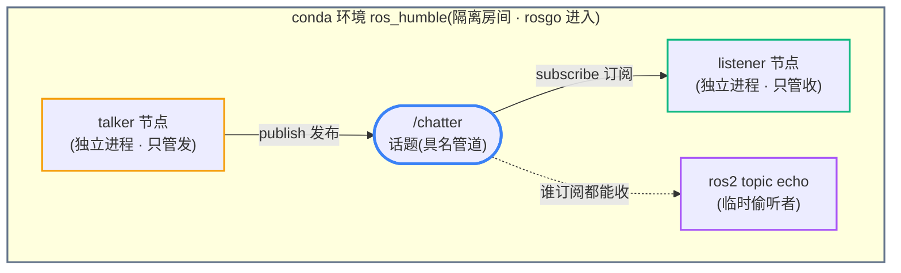

# 03 · ROS2 入门 —— 工具栈、命令、设计理念

> 活文档。这份把"我们到底装了什么、怎么用、它为什么这么设计、摸到哪一步、往下会深到哪"一次讲清，供复习。
> 篇章顺序按认知递进：**装了什么 → 怎么用（命令）→ 为什么这么设计 → 到了哪 / 往哪深**。

---

## 一、工具栈 —— 我们装了什么，各自干嘛

学 ROS2 这一路装了一串东西，名字容易混。先一张表理清各自的角色：

| 名字 | 是什么（一句话） | 类比（iOS 视角） |
|------|----------------|-----------------|
| **ROS2** | 机器人操作系统（不是真 OS，是一套让多进程协同的**中间件 + 工具集**）。版本用 **Humble** | 一套跨进程通信框架 + CLI 工具 |
| **conda** | 软件的**环境/包管理器**（"软件管家"）：装软件 + 隔离环境 | ≈ CocoaPods / npm，但更强 |
| **miniforge** | conda 的**精简发行版**，我们装的就是它（在 `~/miniforge3`） | conda 的安装包 |
| **mamba** | conda 的**加速版**（同样的活跑得快），miniforge 自带 | 更快的 pod install |
| **conda-forge** | 一个**软件仓库**（社区维护，包最全），conda 从这里下载 | 一个 pod 源 |
| **RoboStack** | 把 ROS2 打包成 conda 包的项目，让 ROS2 能**原生装进 conda**（免 Docker/免虚拟机） | 让 ROS2 变成一个能 pod install 的库 |

记一句：**conda 是软件管家，miniforge 是它的安装包，mamba 是快跑腿，conda-forge / RoboStack 是进货仓库。ROS2 是我们真正要学的主角。**

### ⚠️ conda ≠ CUDA（差一个字母，毫无关系）

- **conda**：软件管家（我们用的，天天用）。
- **CUDA**：NVIDIA 显卡的 GPU 计算平台（拿显卡训练模型用）。**我们没用、没装，这台 Apple Silicon Mac 也装不了。**

两者只是名字像。CUDA 属于我们架构里**最外圈的"云端训练环"**（见 `02` 内环外环图），而现在学的 ROS2 是**第2层中间件、纯本地纯 CPU**，隔着好几层。CUDA 是未来到"训练模型"阶段才碰的东西，现在提它属于超纲。

### 为什么用 RoboStack 这套装法（而非 Docker）

- 公司**禁 Docker**；conda 装到用户目录不受限。
- Apple Silicon 上 conda 原生跑最快，免虚拟机、免管理员权限。
- **代价**：ROS2 关在 conda 的隔离环境 `ros_humble` 里，每个新终端要先"进环境"才能用（见下）。

---

## 二、常用命令 —— 手边速查

### 0. 进出环境（每次开终端第一件事）

```bash
rosgo              # 自定义命令：进入 ros_humble 环境（= source conda.sh + conda activate）
                   # 成功后行首出现 (ros_humble)
conda deactivate   # 退出环境（或直接关窗口）
```
> `rosgo` 是写在 `~/.zshrc` 里的自定义函数。为什么每个新窗口都要进一次？因为 conda 环境是**隔离房间**，终端默认站在房间外，`ros2` 命令不在手边——进了房间才有。

### 1. 跑节点

```bash
ros2 run <包名> <可执行名>              # 启动一个节点
ros2 run demo_nodes_cpp talker         # 例：启动发布者（C++ 版）
ros2 run demo_nodes_py  listener       # 例：启动订阅者（Python 版）
ros2 pkg list                          # 列出所有已装的包
ros2 pkg executables demo_nodes_cpp    # 列出某个包里有哪些可执行节点
```

### 2. 看话题（topic）—— 节点间通信的管道

```bash
ros2 topic list            # 列出当前所有活跃话题（频道跟着节点走：没节点用就不出现）
ros2 topic echo /chatter   # 实时偷听某话题的内容（不用写订阅节点，任何人都能听）
ros2 topic info /chatter   # 看这话题：有几个发布者/订阅者、数据类型是什么
ros2 topic hz   /chatter   # 看这话题的发布频率（talker 约 1Hz）
```

### 3. 看节点（node）

```bash
ros2 node list             # 列出当前运行的节点
ros2 node info /talker     # 看某节点：它发布/订阅哪些话题、有哪些服务
```

> 停止任何前台节点/命令：`Ctrl+C`。

---

## 三、设计理念 —— 它凭什么这么设计

### 核心：节点 + 话题 + 发布/订阅



三个概念：
- **节点（node）**：一个独立进程，只干一件事（talker 只管发、listener 只管收）。
- **话题（topic）**：一根**具名管道**（如 `/chatter`），节点往里发 / 从里收。
- **发布/订阅（pub-sub）**：发送方往话题**广播**、订阅方从话题**收**，**两者互不认识，只认频道名**。

### 它在"模拟"什么 —— 解耦

关键洞察：**talker 从不知道 listener 存在**。它只是往 `/chatter` 喊"我不管谁听"，任何订阅这个话题的人（listener、甚至临时的 `ros2 topic echo`）都能收到。

这个模式**你在 iOS 里见过** —— 就是 **NotificationCenter / EventBus / 消息总线**：发送方 `post`，接收方 `observe`，靠一个"通知名"对接，谁都不直接持有谁。

**ROS2 的不同之处**（也是它为机器人而生的原因）：
- 你的 App 里 pub-sub 通常是**同进程内**对象在收发。
- ROS2 里 talker/listener 是**两个完全独立的进程**，甚至能跑在**不同机器 / 不同板子**上，照样通信。

**这就是机器人系统的地基**：正因为通信是解耦的、跨进程的，才能把"感知""规划""控制"拆到不同的板子（对应 `02` 里的分层异构），彼此还能协同。想加一个新模块处理相机数据？它订阅相机话题就行，相机节点一行代码都不用改——**热插拔**。

→ 对照 `02` 的架构图：**话题/pub-sub 就是第2层"中间件"的真身**，我们今天亲手跑通的，正是那一层。

### 我们摸到哪了（诚实定位）

**做到了**：装好环境、跑通别人写好的 demo 节点、用命令观察节点和话题、理解了 pub-sub 解耦。属于**"会用、看懂机制"**。

**还没碰**（下面第四节展开）：自己**写**节点、话题之外的另两种通信模式（服务/动作）、消息类型定义、多节点编排、坐标变换 TF……**目前是"入了门看清地基"，离"能搭系统"还早，但地基是对的。**

---

## 四、往下会深到哪 —— 深度地图（路标，不超纲）

当前站位打 ★，让你知道现在这点是整座山的哪里，别误以为学完了：

```
ROS2 掌握深度（由浅入深）
├── L1 环境与运行     ★ 已到：装环境、rosgo、ros2 run 跑节点
├── L2 通信机制观察   ★ 已到：topic list/echo/info，理解 pub-sub 解耦
├── L3 自己造节点        ← M1 下一步：几行 Python 写 talker/listener，从"用"到"造"
├── L4 三种通信范式         M1：话题(topic,广播) / 服务(service,一问一答) / 动作(action,长任务带反馈)
├── L5 消息与接口           M1：msg/srv 类型定义，节点间传结构化数据
├── L6 编排与工具           M1：launch 一键起多节点、rosbag 录包回放、rqt_graph 看节点图
├── L7 坐标变换 TF          M1-M2：机器人多个坐标系怎么统一（和你做的时序对齐/多源同步同构）
└── L8 仿真闭环             M2：Gazebo 里让虚拟机器人真的动，sense→plan→act 跑起来
```

**下一步（M1 起点）= L3：不再用别人的 demo，自己写一个 talker 和一个 listener。** 从"会用节点"跨到"会造节点"——这是真正开始动手做机器人软件的第一行代码。

---

## 参考

- 动手流水账（今天怎么一步步跑通的）：`notes/M0-环境搭建.md`
- 里程碑复盘：`复盘.md`
- 系统架构（话题=第2层中间件）：`02-机器人系统构造.md`
